# Práctica 1: Instalación y Configuración Inicial de Spring Boot


Este repositorio contiene el proyecto `fundamentos01`, desarrollado como parte de la Práctica 1 para comprender la arquitectura inicial, configuración y despliegue de una API REST utilizando Spring Boot y un servidor Tomcat embebido.

## Información Académica
* **Universidad:** Universidad Politécnica Salesiana (UPS)
* **Carrera:** Ciencias de la Computación
* **Asignatura:** Programación y Plataformas Web
* **Docente:** Ing. Pablo Torres
* **Estudiante:** Cristina Loja  clojap1@est.ups.edu.ec

---

## Tecnologías y Herramientas
* **Lenguaje:** Java 17 (Compatible hasta v25)
* **Framework:** Spring Boot 4.0.0
* **Dependencias:** Spring Web, Spring Boot DevTools
* **Build Tool:** Gradle (Groovy DSL)
* **Servidor:** Apache Tomcat (Embebido)

---

## Ejecución del Proyecto

Para levantar el servidor en un entorno local de Windows, ejecuta el siguiente comando en la terminal en la raíz del proyecto:

```powershell
.\gradlew.bat bootRun
```

> **Nota:** Si existe un problema de memoria RAM o puertos ocupados, se puede ejecutar el proyecto forzando una nueva instancia de memoria con: `.\gradlew.bat bootRun --no-daemon -Dorg.gradle.jvmargs="-Xmx256m"`

---

## Endpoints Implementados

### Estado del Servicio
Verifica que la API está en línea y funcionando correctamente.

* **URL:** `/api/status`
* **Método HTTP:** `GET`
* **Respuesta Exitosa (JSON):**

```json
{
  "service": "Spring Boot API",
  "status": "running",
  "timestamp": "2026-06-14T17:22:01.242"
}
```
---

## Configuración del Entorno de Red
El proyecto utiliza un archivo `application.yml` para gestionar la configuración del servidor, centralizando las rutas de acceso y el puerto de escucha.

* **Puerto:** `8081`
* **Context Path (Prefijo raíz):** `/api`

### Tabla de Endpoints Disponibles
| Descripción | Ruta (URL Completa) | Método |
| :--- | :--- | :--- |
| Estado del Servicio | `/api/status` | `GET` |
| Lista de Estudiantes | `/api/students` | `GET` |
| Conteo de Estudiantes | `/api/students/count` | `GET` |

---

## Evidencias de la Práctica

A continuación, se presentan las capturas correspondientes a la validación del entorno y funcionamiento del código:

### 1. Verificación de Java
Captura del comando java -version en la terminal, confirmando la instalación de JDK 17 y la configuración correcta de las variables de entorno para el desarrollo del proyecto.


### 2. Servidor Spring Boot en Ejecución
Captura de la terminal mostrando el log del proceso bootRun, donde se confirma el arranque del servidor Tomcat embebido y el inicio satisfactorio del contexto de la aplicación.


### 3. Prueba del Endpoint en el Navegador
Captura del navegador web accediendo a localhost:8080/api/status, visualizando la respuesta JSON que confirma que el servicio se encuentra en estado "running".


### 4. Estructura del Controlador
Captura del entorno de desarrollo (IDE) mostrando el código fuente del controlador, donde se observa la implementación de las anotaciones @RestController y @GetMapping.


### 5. Gestión de Estudiantes
Visualización de la colección de objetos `Student` serializada a JSON mediante el endpoint configurado.


### 6. Conteo de Estudiantes
Visualización del resultado del endpoint `/api/students/count`, mostrando el total de registros procesados.


### 5. Conclusión

* **Funcionamiento del endpoint (/api/status):** Comprendí que el endpoint funciona como una interfaz de comunicación expuesta mediante el protocolo HTTP. Al realizar una petición de tipo GET a la ruta /api/status, el framework Spring Boot intercepta la solicitud, la dirige al método correspondiente en el controlador gracias a la anotación @GetMapping("/api/status"), procesa la lógica interna y genera una respuesta automática en formato JSON. Esta respuesta incluye datos dinámicos como el timestamp y el status del servicio, permitiendo que cualquier cliente pueda consumir esta información de manera estructurada.

* **Función general de Spring Boot en la creación del servidor:** La función principal de Spring Boot es automatizar y simplificar la creación de servidores web, eliminando la necesidad de configurar manualmente servidores externos como Apache Tomcat. Al ser un framework basado en el concepto de "servidor embebido", Spring Boot inicia automáticamente el entorno de ejecución necesario al momento de ejecutar la aplicación. Esto centraliza la configuración, gestión de dependencias y despliegue dentro del mismo proyecto, garantizando que el servidor esté siempre listo y optimizado para la aplicación específica que estamos desarrollando.


-----------------------------------------------------------------------------------------

# Práctica 3: Desarrollo de API REST con Spring Boot (Users & Products)

Este proyecto corresponde a la Práctica 3, donde se implementa una API REST en Spring Boot utilizando almacenamiento en memoria (Listas), aplicando controladores, DTOs y mappers para gestionar usuarios y productos.

## Endpoints USERS

GET /api/users
GET /api/users/{id}
POST /api/users
PUT /api/users/{id}
PATCH /api/users/{id}
DELETE /api/users/{id}

## Endpoints PRODUCTS

GET /api/products
GET /api/products/{id}
POST /api/products
PUT /api/products/{id}
PATCH /api/products/{id}
DELETE /api/products/{id}

## Pruebas con Bruno

### Crear Usuario

{
  "name": "Cristina",
  "email": "cristina@est.ups.edu.ec",
  "password": "12345"
}

### Productos

Producto 1:
{
  "name": "Laptop Dell",
  "price": 1200.50,
  "stock": 10
}

Producto 2:
{
  "name": "Mouse Logitech",
  "price": 25.50,
  "stock": 50
}

Producto 3:
{
  "name": "Teclado Redragon",
  "price": 45.00,
  "stock": 20
}

## Evidencias

- GET /api/products (lista de productos)


- GET /api/products/{id}


- DELETE /api/products/{id} existente


- DELETE /api/products/{id} inexistente


## Conclusión

Se implementó una API REST funcional con Spring Boot aplicando arquitectura basada en controladores, DTOs y mappers. Se utilizó almacenamiento en memoria mediante listas para simular una base de datos. Se validaron todos los endpoints mediante la herramienta Bruno, comprobando el funcionamiento correcto del CRUD para usuarios y productos.

------------------------------------------------------------------------------------------

# Práctica 4: Controladores + Servicios + Lógica de Negocio en Spring Boot

## Objetivo de la práctica

En esta práctica se refactorizó la arquitectura del proyecto, separando la lógica de negocio del controlador mediante el uso de la capa de servicios (`@Service`). Esto permite aplicar una arquitectura más limpia y escalable basada en capas.

---

## Arquitectura implementada

El flujo de la aplicación ahora es el siguiente:

Cliente  
→ Controller  
→ Service  
→ ServiceImpl  
→ List en memoria  
→ Mapper  
→ DTO de respuesta  

---

## Tecnologías utilizadas

* Java 17  
* Spring Boot  
* Spring Web  
* Programación en capas (Controller - Service - Mapper - DTO)  
* Stream API  
* Inyección de dependencias  

---

## Estructura del módulo Users

Se implementó un CRUD completo para usuarios con la siguiente estructura:

* UserModel  
* UserController  
* UserService (interfaz)  
* UserServiceImpl (lógica de negocio)  
* UserMapper  
* DTOs:
  - CreateUserDto  
  - UpdateUserDto  
  - PartialUpdateUserDto  
  - UserResponseDto  
  - ErrorResponseDto  

---

## Estructura del módulo Products

Se replicó la misma arquitectura del módulo Users para Products:

* ProductModel  
* ProductController  
* ProductService (interfaz)  
* ProductServiceImpl  
* ProductMapper  
* DTOs:
  - CreateProductDto  
  - UpdateProductDto  
  - PartialUpdateProductDto  
  - ProductResponseDto  

---

## Funcionalidades implementadas

### Users API

| Método | Endpoint | Descripción |
|------|---------|-------------|
| GET | /api/users | Listar usuarios |
| GET | /api/users/{id} | Buscar usuario por ID |
| POST | /api/users | Crear usuario |
| PUT | /api/users/{id} | Actualización completa |
| PATCH | /api/users/{id} | Actualización parcial |
| DELETE | /api/users/{id} | Eliminar usuario |

---

### Products API

| Método | Endpoint | Descripción |
|------|---------|-------------|
| GET | /api/products | Listar productos |
| GET | /api/products/{id} | Buscar producto por ID |
| POST | /api/products | Crear producto |
| PUT | /api/products/{id} | Actualización completa |
| PATCH | /api/products/{id} | Actualización parcial |
| DELETE | /api/products/{id} | Eliminar producto |

---

## Evidencias de la práctica

### 1. ProductServiceImpl.java

Captura donde se evidencia:
* uso de @Service  
* lista en memoria  
* generación de ID  
* lógica CRUD completa  
* uso de mapper  


---

### 2. ProductsController.java

Captura donde se evidencia:
* inyección de ProductService  
* endpoints REST  
* ausencia de lógica de negocio en el controlador  


## Explicación breve

### ¿Cómo se inyecta el servicio en el controlador?

El servicio se inyecta en el controlador mediante **inyección de dependencias por constructor**.

Spring Boot detecta automáticamente la clase que implementa la interfaz `UserService` o `ProductService` gracias a la anotación `@Service`.

Luego, al crear el controlador, Spring proporciona la instancia del servicio como parámetro del constructor:

private final UserService service;

public UsersController(UserService service) {
    this.service = service;
}


### Conclusión

En esta práctica se aplicó el patrón de arquitectura por capas en Spring Boot, separando la lógica de negocio del controlador mediante la implementación de servicios. Esto permitió mejorar la organización del código, facilitar el mantenimiento y seguir buenas prácticas de desarrollo backend.


-------------------------------------------------------------------------

# Práctica 5: Persistencia con Spring Boot y PostgreSQL

## Introducción
En esta práctica se migró el CRUD de la aplicación desde una gestión de datos en memoria hacia una base de datos relacional persistente utilizando **PostgreSQL** y **Spring Data JPA**. Se implementó el uso de contenedores mediante **Docker** para garantizar un entorno de desarrollo reproducible, facilitando la conexión y gestión de la base de datos `devdb`.

## Flujo de Datos
El flujo de datos sigue la arquitectura de capas, permitiendo la separación de responsabilidades:
* **Cliente**: Realiza peticiones HTTP al `Controller`.
* **Service**: Gestiona la lógica de negocio y utiliza el `Repository`.
* **Repository**: Ejecuta operaciones de persistencia mediante JPA e Hibernate.
* **BaseEntity**: Se utiliza como superclase para heredar campos de auditoría (`id`, `createdAt`, `updatedAt`, `deleted`) en todas las entidades, garantizando consistencia y eliminando código duplicado.

## Configuración del Entorno
* **Base de Datos**: Se configuró un contenedor PostgreSQL mediante Docker usando el volumen `pgdata` para asegurar que los datos persistan aunque el contenedor se elimine.
* **Conexión**: Se configuró el archivo `application.yml` para establecer la conexión mediante `jdbc:postgresql://localhost:5432/devdb` con el usuario `ups`.

## Evidencias del CRUD con PostgreSQL

### 4.1. Estado del Contenedor en Docker
Se verificó que el contenedor `postgres-dev` esté activo y operando en el puerto 5432.


### 4.2. Peticiones de la API (Bruno)
Se realizaron pruebas de creación (POST), actualización (PUT) y borrado lógico (DELETE) mediante la herramienta Bruno, garantizando que el servicio responde correctamente.


### 4.3. Verificación en Base de Datos
Se realizó una consulta directa a la base de datos para validar la persistencia y el borrado lógico (`deleted = true` para el smartphone).


Se realizo una practica en clases de crear dos productos, cambiar el nombre de un producto y elimniar.


```sql
-- Consulta SQL utilizada para verificar la persistencia y el borrado lógico
SELECT * FROM products;

```

------------------------------------------------------------------------------------

# Practica 06 - Frameworks Backend: Spring Boot – Validación de DTOs y Reglas de Entrada

# 1. Introducción
En esta práctica se implementó una API REST utilizando Spring Boot, aplicando validación de datos de entrada mediante Jakarta Validation (@Valid), con el objetivo de asegurar la integridad de los datos antes de ser procesados y almacenados en la base de datos. Se trabajó con un módulo de productos que incluye operaciones CRUD, validaciones, reglas de negocio y eliminación lógica (soft delete).


# 2. Validación implementada
Se utilizó Jakarta Validation con: @NotBlank (texto obligatorio), @NotNull (valores obligatorios), @Size (longitud de texto), @Min(0) (evitar negativos), @Valid (activación de validación en controller).

# 3. DTOs implementados
CreateProductDto, UpdateProductDto, PartialUpdateProductDto, ProductResponseDto.

# 4. Reglas de negocio implementadas
No productos con precio negativo, no productos con stock negativo, no actualizar productos eliminados, no eliminar dos veces un producto, no mostrar productos eliminados en consultas.

# 5. Soft Delete
Se implementó eliminación lógica con entity.setDeleted(true); para evitar eliminación física en base de datos.

# 6. Flujo de la aplicación
Cliente → Controller (@Valid) → Service → Model → Entity → Repository → PostgreSQL

# 7. Pruebas realizadas

## Caso inválido
{
  "name": "",
  "price": -5,
  "stock": -2
}
Resultado: 400 Bad Request

## Caso válido
{
  "name": "Mouse Logitech",
  "price": 25.5,
  "stock": 10
}
Resultado: Producto creado correctamente (200 OK)

## DELETE
DELETE /products/{id}
Resultado: 200 OK (respuesta vacía)

## Verificación soft delete
GET /products → el producto eliminado NO aparece.

# 8. EVIDENCIAS

## CRUD de productos (Bruno)


Esta captura muestra el funcionamiento completo del CRUD de productos (crear, listar, actualizar y eliminar).

---

## Validación de DTO (error 400 Bad Request)


Esta captura muestra la validación de datos de entrada con @Valid, generando error 400 cuando los datos son incorrectos.

---

## Listado de productos


Esta captura muestra la consulta de todos los productos disponibles (GET /products), donde no aparecen los eliminados.

---

## Eliminación de producto (Soft Delete)


Esta captura muestra la eliminación lógica de un producto mediante DELETE, sin borrarlo físicamente de la base de datos.

---

## Verificación de Soft Delete


Esta captura muestra que el producto eliminado ya no aparece en el listado GET /products, confirmando el soft delete.


# 9. Conclusión
Se implementó una API REST con Spring Boot aplicando validación de DTOs, reglas de negocio y eliminación lógica, garantizando integridad de datos antes de persistir en la base de datos.

# Resultado final
API funcional, validación de datos, CRUD completo, soft delete y arquitectura en capas.

-------------------------------------------------------------------------------------------

# Práctica 7 - Manejo Global de Errores y Excepciones

---

## Objetivo

Implementar un sistema global para el manejo de errores en el módulo **Products**, utilizando excepciones personalizadas, un manejador global de excepciones y un formato estándar para las respuestas de error.

---

# Funcionalidades implementadas

- Manejo global de excepciones mediante `@RestControllerAdvice`.
- Excepción base `ApplicationException`.
- Excepción `NotFoundException`.
- Excepción `ConflictException`.
- Excepción `BadRequestException`.
- Respuesta estándar mediante `ErrorResponse`.
- Validación automática de DTOs con `@Valid`.
- Eliminación lógica de productos.
- Validación de productos duplicados.
- Validación de productos inexistentes.

---

# Estructura implementada

```
core
└── exceptions
    ├── base
    │   └── ApplicationException.java
    │
    ├── domain
    │   ├── NotFoundException.java
    │   ├── ConflictException.java
    │   └── BadRequestException.java
    │
    ├── handler
    │   └── GlobalExceptionHandler.java
    │
    └── response
        └── ErrorResponse.java
```

---

# Evidencias

## 1. Error por producto inexistente

### Solicitud

```
GET /products/999
```

### Resultado esperado

```
404 Not Found
```

### Captura

> Agregar aquí la captura del error 404.


---

## 2. Error por producto duplicado

### Solicitud

```
POST /products
```

```json
{
    "name": "monitor",
    "price": 300,
    "stock": 20
}
```

### Resultado esperado

```
409 Conflict
```

### Captura

> Agregar aquí la captura del error 409.


---

## 3. Error de validación del DTO

### Solicitud

```json
{
    "name": "",
    "price": -5,
    "stock": -1
}
```

### Resultado esperado

```
400 Bad Request
```

### Captura

> Agregar aquí la captura del error 400.


---

## 4. Eliminación lógica

### Solicitud

```
DELETE /products/5
```

Posteriormente:

```
GET /products/5
```

### Resultado esperado

```
404 Not Found
```

### Captura

> Agregar aquí la captura del eliminado lógico.


---

# Conclusiones

- Se implementó un sistema centralizado para el manejo de errores utilizando excepciones personalizadas.
- Se logró un formato uniforme para todas las respuestas de error mediante la clase `ErrorResponse`.
- Se validó correctamente la existencia de productos antes de realizar operaciones de consulta, actualización y eliminación.
- Se implementó la validación para impedir el registro de productos con nombres duplicados.
- Se verificó el correcto funcionamiento de las validaciones automáticas de los DTOs mediante `@Valid`.
- Se comprobó el funcionamiento del eliminado lógico y su integración con las excepciones del sistema.

---

# Resultado

La API responde correctamente con los siguientes códigos HTTP:

| Método | Escenario | Código HTTP |
|---------|-----------|-------------|
| GET | Producto existente | 200 OK |
| GET | Producto inexistente | 404 Not Found |
| POST | Producto válido | 200 OK |
| POST | Producto duplicado | 409 Conflict |
| POST | Datos inválidos | 400 Bad Request |
| PUT | Actualización correcta | 200 OK |
| PATCH | Actualización parcial | 200 OK |
| DELETE | Eliminación lógica | 200 OK |
| GET | Producto eliminado | 404 Not Found |

-----------------------------------------------------------------------------------------------

## Práctica 8 - Soft Delete

## Descripción

En esta práctica se implementó el borrado lógico (Soft Delete) para los productos de la API REST. En lugar de eliminar físicamente un registro de la base de datos, se actualiza el campo `deleted` a `true`, permitiendo conservar la información para futuras consultas o auditorías.

---

## Objetivos

- Implementar el borrado lógico de productos.
- Evitar la eliminación física de registros.
- Ocultar los productos eliminados en las consultas.
- Mantener la integridad de la información almacenada.

---

## Funcionalidades implementadas

- Eliminación lógica de productos.
- Consulta únicamente de productos activos (`deleted = false`).
- Búsqueda de productos por ID ignorando registros eliminados.
- Búsqueda por nombre ignorando registros eliminados.
- Consulta de productos por usuario.
- Consulta de productos por categoría.
- Exclusión automática de productos eliminados en todas las consultas.

---

## Endpoints implementados

### Obtener todos los productos activos

```http
GET /api/products
```

---

### Obtener un producto por ID

```http
GET /api/products/{id}
```

Ejemplo

```http
GET /api/products/1
```

---

### Crear un producto

```http
POST /api/products
```

Ejemplo

```json
{
  "name": "Laptop Lenovo",
  "price": 1200.50,
  "stock": 10,
  "ownerId": 1,
  "categoryIds": [1,2]
}
```

---

### Actualizar un producto

```http
PUT /api/products/{id}
```

---

### Eliminar un producto (Soft Delete)

```http
DELETE /api/products/{id}
```

El producto no se elimina de la base de datos; únicamente se actualiza el campo:

```text
deleted = true
```

---

## Repositorio

Se implementaron nuevos métodos para trabajar únicamente con productos activos:

- `findByDeletedFalse()`
- `findByIdAndDeletedFalse()`
- `findByNameIgnoreCaseAndDeletedFalse()`
- `findByOwner_IdAndDeletedFalse()`
- `findByCategoryIdAndDeletedFalse()`

---

## Tecnologías utilizadas

- Java 21
- Spring Boot
- Spring Data JPA
- Hibernate
- PostgreSQL
- Maven
- Jakarta Validation

---

## Evidencias

### Antes del borrado

Se consulta el listado de productos activos mediante:

```http
GET /api/products
```


---

### Eliminación lógica

Se ejecuta:

```http
DELETE /api/products/{id}
```


---

### Verificación

Al consultar nuevamente los productos, el registro eliminado ya no aparece en la respuesta porque el sistema únicamente devuelve productos con:

```text
deleted = false
```

En la base de datos el registro permanece almacenado con:

```text
deleted = true
```


---

## Resultado

Se implementó correctamente el mecanismo de Soft Delete, permitiendo conservar los registros en la base de datos mientras se excluyen automáticamente de todas las consultas realizadas por la aplicación.

-----------------------------------------------------------------------------------------------

# Práctica 9 - Filtros Dinámicos

## Descripción

En esta práctica se implementaron filtros dinámicos para la consulta de productos utilizando Spring Data JPA y consultas JPQL. Los filtros permiten realizar búsquedas flexibles mediante parámetros opcionales enviados desde la API REST.

---

## Objetivos

- Implementar consultas dinámicas utilizando JPQL.
- Permitir búsquedas por múltiples criterios.
- Reducir la cantidad de consultas específicas en el repositorio.
- Mejorar la flexibilidad de la API.
- Mantener el uso de Soft Delete en todas las consultas.

---

## Funcionalidades implementadas

- Filtrar productos por usuario propietario.
- Filtrar productos por categoría.
- Buscar productos por nombre.
- Filtrar por precio mínimo.
- Filtrar por precio máximo.
- Combinar varios filtros en una misma consulta.
- Mostrar únicamente productos activos (`deleted = false`).

---

## Endpoints implementados

### Obtener productos de un usuario con filtros

```http
GET /api/products/user/{userId}
```

Parámetros opcionales:

| Parámetro | Descripción |
|-----------|-------------|
| name | Nombre del producto |
| minPrice | Precio mínimo |
| maxPrice | Precio máximo |
| categoryId | Categoría |

Ejemplo:

```http
GET /api/products/user/1?name=laptop&minPrice=500&maxPrice=1500&categoryId=2
```

---

### Obtener productos por categoría con filtros

```http
GET /api/products/category/{categoryId}
```

Parámetros opcionales:

| Parámetro | Descripción |
|-----------|-------------|
| name | Nombre del producto |
| minPrice | Precio mínimo |
| maxPrice | Precio máximo |
| userId | Propietario |

Ejemplo:

```http
GET /api/products/category/2?name=mouse&userId=5&minPrice=20&maxPrice=100
```

---

## Repositorio

Se implementaron consultas JPQL utilizando `@Query` para soportar filtros opcionales mediante parámetros dinámicos.

### Métodos implementados

```java
findByOwnerIdWithFilters(...)
findByCategoryIdWithFilters(...)
```

Estas consultas permiten aplicar filtros solamente cuando los parámetros son enviados por el cliente.

---

## Evidencias

### Consulta por usuario

```http
GET /api/products/user/1
```

Muestra todos los productos pertenecientes al usuario especificado.

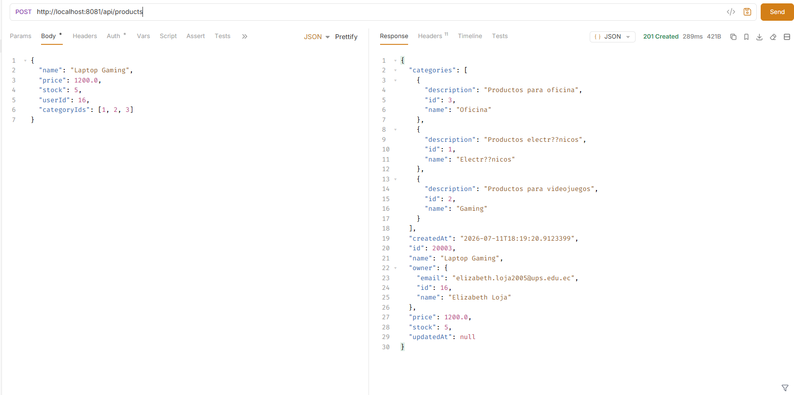


---

### Consulta por usuario con filtros

```http
GET /api/products/user/1?name=laptop&minPrice=500
```

Muestra únicamente los productos que cumplen los criterios enviados.


---

### Consulta por categoría con filtros

```http
GET /api/products/category/2?userId=1&maxPrice=1000
```

Muestra los productos de la categoría indicada aplicando filtros adicionales.


---

## Resultado

Se implementaron filtros dinámicos que permiten realizar consultas flexibles y reutilizables sobre los productos almacenados en la base de datos. La solución reduce la duplicación de código y mejora la capacidad de búsqueda dentro de la API REST.


------------------------------------------------------------------------------------------------

# Práctica 10 (Spring Boot): Paginación de Productos con Page, Slice y Pageable

## 1. Resumen

En esta práctica se implementó paginación sobre el recurso `products` usando Spring Data JPA, mediante las interfaces `Page`, `Slice` y `Pageable`. Se mantuvo el endpoint original sin paginar (`GET /api/products`) para comparar el comportamiento frente a los nuevos endpoints paginados.

También se extendió la paginación al endpoint de productos por categoría (`/api/categories/{id}/products`), agregando las variantes `/page` y `/slice`, conservando los filtros dinámicos ya implementados en la Práctica 9.

---

## 2. Endpoints implementados

### Productos sin paginación

| Método | Ruta             | Descripción                        |
| ------ | ---------------- | ----------------------------------- |
| GET    | `/api/products`  | Lista todos los productos activos  |

### Productos con Page

| Método | Ruta                                                              | Descripción                                |
| ------ | ------------------------------------------------------------------ | ------------------------------------------- |
| GET    | `/api/products/page`                                              | Página inicial con valores por defecto     |
| GET    | `/api/products/page?page=0&size=5`                                | Primera página con 5 registros             |
| GET    | `/api/products/page?page=1&size=10`                               | Segunda página con 10 registros            |
| GET    | `/api/products/page?page=0&size=5&sortBy=price&direction=desc`    | Productos ordenados por precio descendente |
| GET    | `/api/products/page?page=0&size=5&sortBy=name&direction=asc`      | Productos ordenados por nombre ascendente  |

### Productos con Slice

| Método | Ruta                                                                  | Descripción                            |
| ------ | ----------------------------------------------------------------------| ---------------------------------------- |
| GET    | `/api/products/slice`                                                | Slice inicial con valores por defecto  |
| GET    | `/api/products/slice?page=0&size=5`                                  | Primer slice con 5 registros           |
| GET    | `/api/products/slice?page=1&size=5`                                  | Segundo slice con 5 registros          |
| GET    | `/api/products/slice?page=0&size=5&sortBy=createdAt&direction=desc`  | Slice ordenado por fecha descendente   |

### Productos por categoría (paginado)

| Método | Ruta                                                                                | Descripción                              |
| ------ | -------------------------------------------------------------------------------------| ------------------------------------------ |
| GET    | `/api/categories/{id}/products`                                                     | Lista sin paginar (se mantiene, Práctica 9) |
| GET    | `/api/categories/{id}/products/page?page=0&size=5`                                  | Productos de la categoría paginados con Page |
| GET    | `/api/categories/{id}/products/page?name=laptop&minPrice=500&page=0&size=5`         | Page con filtros combinados               |
| GET    | `/api/categories/{id}/products/slice?page=0&size=5`                                 | Productos de la categoría paginados con Slice |

---

## 3. Carga masiva de datos

Se generó un script `seed_data.sql` que crea:

- 10 usuarios
- 10 categorías
- 20 000 productos
- ~50 000 relaciones producto-categoría (2 o 3 categorías por producto)

Ejecución dentro del contenedor Docker:

```bash
docker exec -i postgres-dev psql -U ups -d devdb < seed_data.sql
```

o desde PowerShell:

```powershell
Get-Content seed_data.sql | docker exec -i postgres-dev psql -U ups -d devdb
```

Verificación tras la carga:

```
INSERT 0 10       → 10 usuarios
INSERT 0 10       → 10 categorías
INSERT 0 20000    → 20 000 productos
INSERT 0 50002    → 50 002 relaciones producto-categoría
COMMIT
```

---

## 4. Resultados y evidencias

### 4.1. Problema detectado en el endpoint sin paginar

`GET /api/products`


Con 20 000 productos, el endpoint sin paginar mostró un tiempo de respuesta elevado y un tamaño de payload considerable, ya que cada producto incluye información anidada de `owner` y `categories`. Esto evidencia que devolver todos los registros sin límite no escala cuando el volumen de datos crece.

### 4.2. Respuesta con Page

`GET /api/products/page?page=0&size=5`


`Page` evidencia los metadatos completos: `content`, `totalElements`, `totalPages`, `number`, `size`, `first`, `last`.

### 4.3. Respuesta con Slice

`GET /api/products/slice?page=0&size=5&sortBy=createdAt&direction=desc`


A diferencia de `Page`, la respuesta de `Slice` **no** incluye `totalElements` ni `totalPages`, porque no ejecuta la consulta `COUNT`. Esto la hace más rápida y liviana, a costa de no saber el total de registros ni de páginas.

### 4.4. Error por paginación inválida

`GET /api/products/page?page=-1&size=0`


Esto confirma que las validaciones `@Min` de `PaginationDto` funcionan correctamente junto con el `GlobalExceptionHandler`.

### 4.5. Endpoint de categoría paginado con Page

`GET /api/categories/1/products/page?page=1&size=10`


Se evidencia:
- Productos filtrados por la categoría indicada
- Paginación aplicada (`totalElements: 4459`, `totalPages: 446`)
- Filtros de la Práctica 9 (`name`, `minPrice`, `maxPrice`, `userId`) siguen disponibles junto con la paginación

### 4.6. Endpoint de categoría paginado con Slice

`GET /api/categories/1/products/slice?page=0&size=5`


Se evidencia:
- Productos filtrados por la categoría indicada
- Metadatos de `Slice` (`first`, `last`, `hasNext`, sin `totalElements`)

---

## 5. Explicación breve

### ¿Cuál es la diferencia entre `Page` y `Slice`?

`Page` ejecuta dos consultas: una para traer los datos (`LIMIT`/`OFFSET`) y otra de tipo `COUNT` para calcular el total de registros y de páginas. Esto permite mostrar información completa de navegación, como "Página 3 de 20" o "150 resultados en total", pero tiene un costo adicional de rendimiento porque cada solicitud ejecuta una consulta extra sobre toda la tabla filtrada.

`Slice`, en cambio, solo ejecuta la consulta de datos y le pide a la base de datos un registro adicional al tamaño de página solicitado (`size + 1`) para determinar si existe una página siguiente (`hasNext`). No sabe cuántos registros existen en total ni cuántas páginas hay. Es más eficiente cuando la interfaz solo necesita avanzar o retroceder, como en un scroll infinito o un botón de "siguiente", sin mostrar el total exacto de resultados.

En resumen: `Page` es más informativo pero más costoso; `Slice` es más liviano pero con información parcial.

### ¿Por qué la paginación debe aplicarse en el repositorio y no después de traer todos los datos en memoria?

Si la paginación se aplicara después de traer todos los registros a memoria (por ejemplo, usando `.stream().skip().limit()` sobre una lista ya cargada desde `findAll()`), la base de datos igual tendría que leer y transportar **todos** los registros de la tabla hacia la aplicación antes de descartar la mayoría de ellos. Esto anula por completo el propósito de paginar: se seguiría consumiendo memoria, ancho de banda y tiempo de procesamiento proporcional al total de datos, no al tamaño de página solicitado.

Al aplicar la paginación directamente en el repositorio mediante `Pageable`, Spring Data JPA traduce `page`, `size` y `sort` en cláusulas SQL `LIMIT`, `OFFSET` y `ORDER BY` que se ejecutan **dentro de la base de datos**. Esto significa que PostgreSQL solo lee y devuelve la cantidad exacta de filas necesarias para esa página, sin importar si la tabla tiene 100 o 20 000 000 de registros. Es la única forma de que la paginación realmente mejore el rendimiento y escale con el crecimiento de los datos.

---
--------------------------------------------------------------------------------------

# Práctica 11 - Autenticación con JWT y Spring Security


---

# Objetivo

Implementar autenticación mediante Spring Security y JSON Web Token (JWT), permitiendo el registro e inicio de sesión de usuarios para proteger los endpoints de la API.

---

# Funcionalidades implementadas

- Registro de usuarios.
- Inicio de sesión.
- Generación de JWT.
- Protección de endpoints.
- Roles ROLE_USER y ROLE_ADMIN.
- Autenticación Stateless.
- BCrypt para cifrado de contraseñas.

---

# Flujo de autenticación

1. Registro del usuario.
2. Contraseña cifrada con BCrypt.
3. Inicio de sesión.
4. Generación del JWT.
5. Envío del token en Authorization Bearer.
6. Validación automática mediante Spring Security.

---

# Pruebas realizadas

## Prueba 1 - Registro

```
POST /auth/register
```

```json
{
  "name":"Cristina Loja",
  "email":"cristina.test@ups.edu.ec",
  "password":"Password123"
}
```

Resultado esperado

- 201 Created
- Token JWT
- ROLE_USER


---

## Prueba 2 - Login

```
POST /auth/login
```

```json
{
  "email":"cristina.test@ups.edu.ec",
  "password":"Password123"
}
```

Resultado esperado

- 200 OK
- JWT válido


---

## Prueba 3 - Endpoint protegido sin token

```
GET /products/page?page=0&size=5
```

Resultado esperado

```
401 Unauthorized
```


---

## Prueba 4 - Endpoint protegido con token

```
GET /products/page?page=0&size=5
```

Authorization

```
Bearer <token>
```

Resultado esperado

```
200 OK
```


---

# Conclusiones

La autenticación mediante JWT permitió proteger correctamente los recursos de la API. Spring Security valida automáticamente el token enviado por el cliente antes de permitir el acceso a los endpoints protegidos, implementando un modelo Stateless seguro y escalable.

----------------------------------------------------------------------------------------------------

# Práctica 12 - Autorización mediante Roles y @PreAuthorize

---

# Objetivo

Implementar autorización basada en roles utilizando Spring Security y la anotación **@PreAuthorize**, restringiendo el acceso a determinados endpoints únicamente a usuarios con permisos de administrador.

---

# Funcionalidades implementadas

- Protección mediante @PreAuthorize.
- Roles ROLE_USER.
- Roles ROLE_ADMIN.
- Restricción del endpoint GET /products.
- Manejo de errores 401 y 403.

---

# Flujo de autorización

1. Usuario inicia sesión.
2. Obtiene JWT.
3. JWT contiene los roles.
4. Spring Security valida el rol.
5. Si posee ROLE_ADMIN puede acceder.
6. Caso contrario devuelve 403 Forbidden.

---

# Pruebas realizadas

## Prueba 1 - Usuario ROLE_USER

```
POST /auth/login
```

Resultado esperado


---

## Prueba 2 - ROLE_USER intenta acceder

```
GET /products
```

Authorization

```
Bearer <token ROLE_USER>
```

Resultado esperado

```
403 Forbidden
```

Mensaje esperado

```
No tienes permisos para acceder a este recurso
```


---

## Prueba 3 - Login con administrador

```
POST /auth/login
```

Resultado esperado


---

## Prueba 4 - Administrador consulta productos

```
GET /products
```

Authorization

```
Bearer <token ROLE_ADMIN>
```

Resultado esperado

```
200 OK
```


---


# Conclusiones

La implementación de autorización basada en roles permitió restringir el acceso a recursos sensibles de la API. Mediante la anotación **@PreAuthorize**, únicamente los usuarios con ROLE_ADMIN pueden acceder a los endpoints administrativos, mientras que los usuarios con ROLE_USER mantienen acceso únicamente a los recursos permitidos. Las pruebas realizadas confirmaron el correcto funcionamiento de los códigos HTTP 200, 401 y 403 según el nivel de autorización del usuario.

----------------------------------------------------------------------------------------

# Práctica 13 - Validación de Ownership con Spring Security y JWT

---

# Información

---

# Objetivo

Implementar un mecanismo de validación de ownership (propiedad del recurso) para garantizar que únicamente el propietario de un producto o un usuario con rol **ROLE_ADMIN** pueda modificar o eliminar dicho recurso.

La autenticación se realiza mediante JWT y el propietario del producto se obtiene automáticamente desde el usuario autenticado, evitando que el cliente envíe manualmente un identificador de usuario.

---

# Pruebas realizadas en Bruno

Todas las pruebas se realizaron utilizando autenticación JWT mediante el encabezado:

```http
Authorization: Bearer <token>
```

---

# Prueba 1 - Registro de usuarios

### Usuario A

```
POST /auth/register
```

```json
{
  "name": "Usuario A",
  "email": "usera@ups.edu.ec",
  "password": "Password123"
}
```

Resultado esperado

- 201 Created
- Se genera un JWT.
- Se asigna ROLE_USER.


---

### Usuario B

```
POST /auth/register
```

```json
{
  "name": "Usuario B",
  "email": "userb@ups.edu.ec",
  "password": "Password123"
}
```

Resultado esperado

- 201 Created
- Se genera un JWT.
- Se asigna ROLE_USER.


---

# Prueba 2 - Creación del producto

El Usuario A crea un producto.

```
POST /products
```

```json
{
  "name": "Laptop Usuario A",
  "price": 900,
  "stock": 10,
  "categoryIds": [1,2]
}
```

No se envía ningún **userId**, ya que el propietario se obtiene desde el JWT.

Resultado esperado

- 200 OK

La respuesta debe mostrar:

```json
"owner": {
    "email": "usera@ups.edu.ec"
}
```


---

# Prueba 3 - Usuario B intenta modificar el producto

```
PUT /products/{id}
```

```json
{
  "name": "Hackeado",
  "price": 1,
  "stock": 1,
  "categoryIds": [1]
}
```

Resultado esperado

```
403 Forbidden
```

Mensaje esperado

```json
{
   "message":"No puedes modificar productos ajenos"
}
```


---

# Prueba 4 - Usuario B intenta eliminar el producto

```
DELETE /products/{id}
```

Resultado esperado

```
403 Forbidden
```


---

# Prueba 5 - Usuario A modifica su producto

```
PUT /products/{id}
```

```json
{
  "name": "Laptop A Actualizada",
  "price": 950,
  "stock": 8,
  "categoryIds": [1,2]
}
```

Resultado esperado

```
200 OK
```

---

# Prueba 6 - Administrador modifica el producto

```
PUT /products/{id}
```

```json
{
  "name": "Modificado por ADMIN",
  "price": 1100,
  "stock": 20,
  "categoryIds": [1,2]
}
```

Resultado esperado

```
200 OK
```

---

# Conclusiones

La implementación de la validación de ownership permitió garantizar que únicamente el propietario de un recurso pueda modificarlo o eliminarlo. El propietario del producto se obtiene directamente del usuario autenticado mediante el token JWT, evitando que el cliente pueda manipular el identificador del usuario.

Las pruebas realizadas demostraron que un usuario autenticado únicamente puede administrar sus propios productos, mientras que los usuarios con privilegios de administrador mantienen acceso completo a todos los recursos del sistema.

Esta práctica fortalece la seguridad de la API al combinar autenticación mediante JWT, autorización basada en roles y control de acceso basado en ownership, siguiendo las buenas prácticas para el desarrollo de servicios REST seguros.

---

# Práctica 14 (Spring Boot): Renovación de Access Token con Refresh Token

---

## 1. Resumen

En esta práctica se implementó un mecanismo de **refresh token** para permitir que los usuarios renueven su sesión sin necesidad de volver a autenticarse cada vez que expira el access token.

Se implementó:

- Diferenciación entre **access token** y **refresh token** mediante un claim `type` dentro del JWT.
- Persistencia del refresh token en base de datos (tabla `refresh_tokens`), permitiendo revocarlo.
- **Rotación** de refresh tokens: cada vez que se usa uno para renovar la sesión, queda revocado y se genera uno nuevo.
- Endpoint `/auth/refresh` para renovar tokens.
- Endpoint `/auth/logout` para cerrar sesión revocando el refresh token.
- Rechazo explícito de refresh tokens cuando se intentan usar como access token en el header `Authorization`.

---

## 3. Endpoints

| Método | Ruta                | Descripción                                   | Autenticación |
| ------ | ------------------- | ---------------------------------------------- | -------------- |
| POST   | `/api/auth/login`   | Inicia sesión, devuelve access + refresh token | Pública        |
| POST   | `/api/auth/register`| Registra usuario, devuelve access + refresh    | Pública        |
| POST   | `/api/auth/refresh` | Renueva tokens usando un refresh token válido  | Pública (valida refresh token en el body) |
| POST   | `/api/auth/logout`  | Revoca un refresh token                        | Pública (valida refresh token en el body) |

---

## 4. Resultados y evidencias

### 4.1. Login: devuelve access token y refresh token

`POST /api/auth/login`

```json
{
  "email": "usera@ups.edu.ec",
  "password": "Password123"
}
```

Respuesta real obtenida (`200 OK`):

```json
{
  "token": "eyJhbGciOiJIUzI1NiJ9...",
  "refreshToken": "eyJhbGciOiJIUzI1NiJ9...",
  "userId": 13,
  "name": "Usuario A",
  "email": "usera@ups.edu.ec",
  "roles": ["ROLE_USER"],
  "type": "Bearer"
}
```

Al decodificar cada JWT se confirma la diferenciación por claim `type`:

- Access token → `"type": "access"`, expira en 30 minutos (`exp - iat = 1800`).
- Refresh token → `"type": "refresh"`, expira en 7 días (`exp - iat = 604800`).

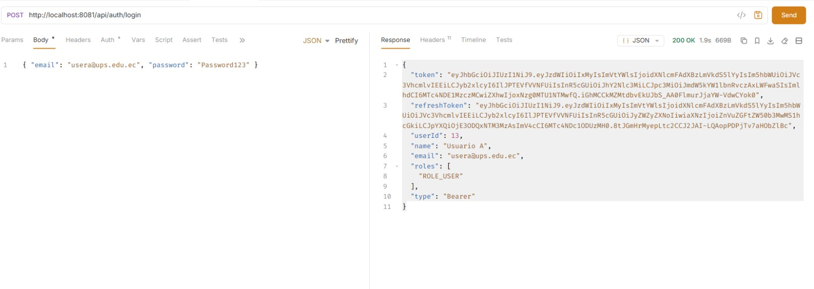

---

### 4.2. Endpoint protegido con access token

`GET /api/products/page?page=0&size=5`
`Authorization: Bearer <access-token>`

Resultado: `200 OK` — el access token es aceptado normalmente por `JwtAuthenticationFilter`.


---

### 4.3. Refresh token rechazado como access token

`GET /api/products/page?page=0&size=5`
`Authorization: Bearer <refresh-token>`

Resultado: `401 Unauthorized`

Esto confirma que `JwtAuthenticationFilter` usa `jwtUtil.validateAccessToken(jwt)`, el cual rechaza cualquier token cuyo claim `type` no sea `"access"`, incluso si la firma del JWT es válida.

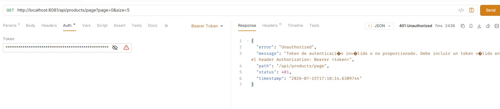

---

### 4.4. Refresh exitoso

`POST /api/auth/refresh`

```json
{
  "refreshToken": "<refresh-token-del-login>"
}
```

Respuesta real obtenida (`200 OK`):

```json
{
  "token": "eyJhbGciOiJIUzI1NiJ9... (nuevo access token)",
  "refreshToken": "eyJhbGciOiJIUzI1NiJ9... (nuevo refresh token)",
  "userId": 13,
  "name": "Usuario A",
  "email": "usera@ups.edu.ec",
  "roles": ["ROLE_USER"],
  "type": "Bearer"
}
```

Se verificó que tanto el `token` como el `refreshToken` devueltos son **distintos** a los del login original (comparando el campo `iat` de cada JWT).

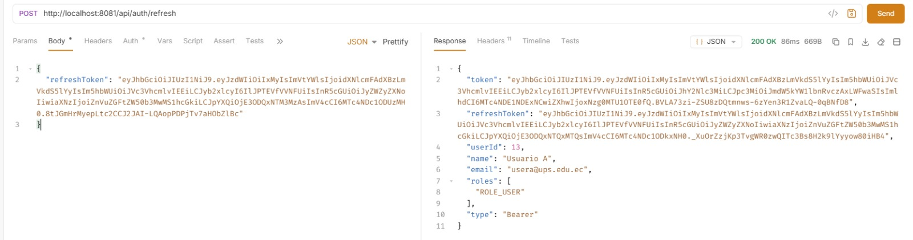

---

### 4.5. Rotación: el refresh token usado queda revocado

Al intentar reutilizar el refresh token del login original (ya usado en el paso 4.4):

`POST /api/auth/refresh`

```json
{
  "refreshToken": "<refresh-token-ya-usado>"
}
```

Respuesta real obtenida (`400 Bad Request`):

```json
{
  "timestamp": "2026-07-15T17:23:04.459",
  "status": 400,
  "error": "Bad Request",
  "message": "Refresh token no encontrado o revocado",
  "path": "/api/auth/refresh"
}
```

Esto confirma que `RefreshTokenService.revoke()` se ejecuta correctamente durante el refresh, invalidando el token anterior y evitando su reutilización.


---

### 4.6. Logout

`POST /api/auth/logout`

```json
{
  "refreshToken": "<refresh-token-actual>"
}
```

Resultado: `204 No Content`

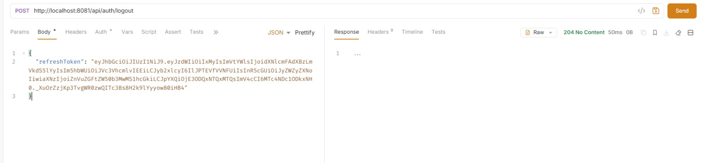

---

### 4.7. Refresh después de logout

`POST /api/auth/refresh`

```json
{
  "refreshToken": "<refresh-token-recien-cerrado>"
}
```

Respuesta real obtenida (`400 Bad Request`):

```json
{
  "timestamp": "2026-07-15T17:27:03.377",
  "status": 400,
  "error": "Bad Request",
  "message": "Refresh token no encontrado o revocado",
  "path": "/api/auth/refresh"
}
```

Esto confirma que el logout revoca efectivamente el refresh token en base de datos, impidiendo que se use para renovar sesión posteriormente.

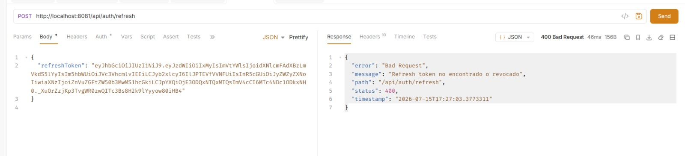

---

## 5. Explicación breve

### ¿Cuál es la diferencia entre access token y refresh token?

El **access token** es el que se envía en cada petición HTTP dentro del header `Authorization: Bearer <token>` para acceder a endpoints protegidos. Tiene una duración corta (30 minutos en este proyecto) precisamente para limitar el daño si llegara a ser robado: aunque un atacante lo obtenga, dejará de ser útil pronto.

El **refresh token**, en cambio, no se usa para acceder a recursos directamente. Su único propósito es solicitar un nuevo par de tokens cuando el access token expira, sin que el usuario tenga que volver a ingresar sus credenciales. Por eso dura mucho más (7 días en este proyecto), pero a cambio se controla de forma más estricta: se guarda en base de datos, se puede revocar en cualquier momento, y se rota cada vez que se usa.

### ¿Por qué el refresh token no debe usarse en `Authorization: Bearer`?

Porque el refresh token no está diseñado para autenticar peticiones a los recursos de la API, sino únicamente para el proceso de renovación. Si se aceptara indistintamente en cualquier endpoint, un token que debería vivir 7 días terminaría teniendo el mismo nivel de exposición que uno de 30 minutos, aumentando significativamente la ventana de riesgo en caso de robo. Por eso el JWT incluye un claim `type` (`access` o `refresh`), y `JwtAuthenticationFilter` valida explícitamente que solo los tokens de tipo `access` puedan autenticar peticiones normales, rechazando cualquier refresh token que se intente usar de esa forma con un `401 Unauthorized`.

### ¿Qué significa rotar un refresh token?

Rotar un refresh token significa que, cada vez que se utiliza para obtener un nuevo access token, ese mismo refresh token se invalida (revoca) inmediatamente y se genera uno completamente nuevo para reemplazarlo. Esto evita que un mismo refresh token pueda reutilizarse de forma indefinida: si alguien intentara usarlo por segunda vez —por ejemplo, porque fue interceptado— la petición sería rechazada porque el sistema ya lo marcó como revocado en la base de datos. La rotación limita el impacto de un posible robo de refresh token a un solo uso.

---

## 6. Consideraciones de seguridad aplicadas

- El refresh token se guarda en la tabla `refresh_tokens`, lo que permite revocarlo de forma controlada (logout) sin depender únicamente de su expiración natural.
- Al iniciar sesión, se revocan todos los refresh tokens anteriores del usuario (`revokeAllByUser`), dejando una única sesión activa por usuario.
- Se valida que el usuario dueño del refresh token siga activo (`!deleted`) antes de emitir nuevos tokens.
- El endpoint `/auth/refresh` no depende del `JwtAuthenticationFilter` estándar; la validación del refresh token ocurre explícitamente en `RefreshTokenService.validateAndGetActiveToken()`.

---


# Práctica 15: Documentación de API con Swagger, OpenAPI y Seguridad JWT

---

# Dependencia utilizada

Para integrar Swagger en Spring Boot se agregó la dependencia de Springdoc OpenAPI en el archivo:

```text
build.gradle.kts
```

Configuración agregada:

```kotlin
implementation("org.springdoc:springdoc-openapi-starter-webmvc-ui:3.0.3")
```

Esta librería permite generar automáticamente la documentación OpenAPI a partir de los controladores, DTOs y configuraciones de seguridad del proyecto.

---

# Configuración de Swagger UI

La aplicación utiliza un contexto base `/api`, por lo que las rutas principales son:

Swagger UI:

```text
http://localhost:8081/api/swagger-ui/index.html
```

Documentación OpenAPI:

```text
http://localhost:8081/api/v3/api-docs
```

La interfaz Swagger permite visualizar todos los controladores disponibles y realizar pruebas directamente desde el navegador.

---

# Configuración de Spring Security

Debido a que el proyecto utiliza Spring Security con autenticación JWT, fue necesario permitir el acceso público a Swagger.

En la configuración de seguridad se agregaron las siguientes rutas:

```java
.requestMatchers(
        "/swagger-ui/**",
        "/swagger-ui.html",
        "/v3/api-docs/**"
).permitAll()
```

No se agregó `/api` dentro de los `requestMatchers`, debido a que Spring Security evalúa las rutas internas sin considerar el contexto del servlet.

Después de esta configuración Swagger puede abrirse sin autenticación.

Los endpoints protegidos continúan solicitando un token JWT válido.

---

# Configuración OpenAPI

Se creó una configuración personalizada para Swagger mediante la clase:

```text
OpenApiConfig.java
```

Esta configuración permite definir:

- Nombre de la API.
- Versión.
- Descripción.
- Servidor base.
- Esquema de autenticación JWT.

Configuración del esquema Bearer JWT:

```java
SecurityScheme bearerScheme = new SecurityScheme()
        .name("bearerAuth")
        .type(SecurityScheme.Type.HTTP)
        .scheme("bearer")
        .bearerFormat("JWT");
```

Esta configuración habilita el botón:

```text
Authorize
```

en Swagger UI.

---

# Uso de JWT en Swagger

Para probar endpoints protegidos se realizó el siguiente procedimiento:

1. Ejecutar el endpoint de login:

```http
POST /api/auth/login
```

2. Ingresar las credenciales del usuario.

Ejemplo:

```json
{
    "email": "cristina.docker@ups.edu.ec",
    "password": "********"
}
```

3. La API devuelve un Access Token y Refresh Token.

Ejemplo:

```json
{
    "token": "eyJhbGciOiJIUzI1NiJ9...",
    "refreshToken": "eyJhbGciOiJIUzI1NiJ9...",
    "userId": 1,
    "name": "Cristina",
    "email": "cristina.docker@ups.edu.ec",
    "roles": [
        "ROLE_USER"
    ],
    "type": "Bearer"
}
```

4. Copiar solamente el valor del token.

Correcto:

```text
eyJhbGciOiJIUzI1NiJ9...
```

Incorrecto:

```text
"token":"eyJhbGciOiJIUzI1NiJ9..."
```

5. Presionar el botón:

```text
Authorize
```

6. Ingresar:

```text
Bearer TOKEN
```

Swagger enviará automáticamente:

```http
Authorization: Bearer TOKEN
```

en los endpoints protegidos.

---

# Documentación de endpoints

Swagger permitió documentar los diferentes módulos de la aplicación.

Controladores disponibles:

## Auth

Endpoints públicos:

```text
POST /api/auth/register
POST /api/auth/login
```

Estos endpoints no requieren token porque permiten crear usuarios e iniciar sesión.

---

## Products

Endpoints protegidos mediante JWT:

```text
GET /api/products
GET /api/products/page
GET /api/products/slice
POST /api/products
PUT /api/products/{id}
DELETE /api/products/{id}
```

Para consumir estos endpoints es necesario enviar un token válido.

---

# Documentación mediante anotaciones

Se utilizaron anotaciones de OpenAPI para mejorar la información mostrada en Swagger.

Ejemplo:

```java
@Operation(
        summary = "Crear producto",
        description = "Crea un producto asociado al usuario autenticado."
)
```

También se documentaron respuestas HTTP:

```java
@ApiResponses(value = {
        @ApiResponse(
                responseCode = "201",
                description = "Producto creado correctamente"
        ),
        @ApiResponse(
                responseCode = "401",
                description = "Token inválido"
        )
})
```

---

# Documentación de DTOs

Los DTOs fueron documentados mediante:

```java
@Schema
```

Ejemplo:

```java
@Schema(
        description = "Correo del usuario",
        example = "usuario@ups.edu.ec"
)
private String email;
```

Esto permite que Swagger muestre información más clara sobre los datos requeridos.

---

# Pruebas realizadas

## Prueba de Swagger UI

Se verificó el acceso mediante:

```text
http://localhost:8081/api/swagger-ui/index.html
```

Resultado:

Swagger cargó correctamente mostrando los controladores y endpoints disponibles.

---

## Prueba de documentación OpenAPI

Se verificó:

```text
http://localhost:8081/api/v3/api-docs
```

Resultado:

Se obtuvo correctamente el documento JSON generado por OpenAPI.

---

## Prueba de login mediante Bruno

Se realizaron pruebas usando Bruno API Client.

Solicitud:

```http
POST /api/auth/login
```

Cuando las credenciales fueron incorrectas se obtuvo:

```json
{
    "error": "Unauthorized",
    "message": "Email o contraseña incorrectos",
    "status":401
}
```

Cuando las credenciales fueron correctas se obtuvo:

```json
{
    "token": "JWT_TOKEN",
    "refreshToken": "REFRESH_TOKEN",
    "userId":1,
    "name":"Cristina",
    "email":"cristina.docker@ups.edu.ec",
    "roles":[
        "ROLE_USER"
    ],
    "type":"Bearer"
}
```

---

# Verificación del estado de la API

Se utilizó Spring Boot Actuator para comprobar que la aplicación estaba funcionando correctamente.

Comando utilizado:

```bash
curl http://localhost:8081/api/actuator/health
```

Respuesta obtenida:

```json
{
    "groups": [
        "liveness",
        "readiness"
    ],
    "status": "UP"
}
```

El estado UP confirma que la API está ejecutándose correctamente.

---

# Evidencias realizadas

Durante la práctica se obtuvieron las siguientes evidencias:

## Swagger UI cargado

Ruta:

```text
http://localhost:8081/api/swagger-ui/index.html
```

Se evidencia:

- Controladores disponibles.
- Endpoints agrupados.
- Documentación automática.

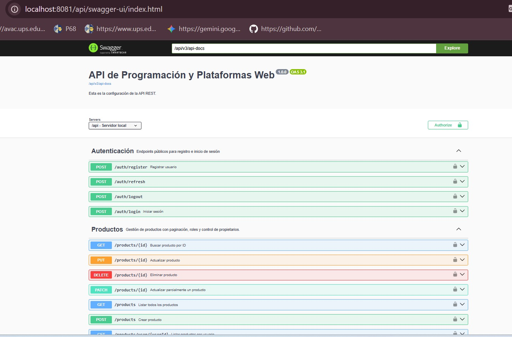

---

## JSON OpenAPI

Ruta:

```text
http://localhost:8081/api/v3/api-docs
```

Se evidencia:

- Información OpenAPI.
- Paths.
- Componentes.
- Schemas.

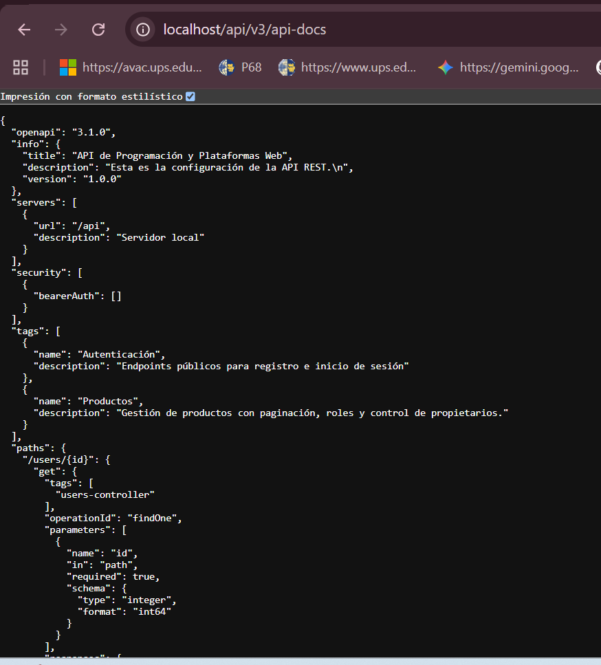

---

## Captura de AuthController documentado

- POST /api/auth/register
- POST /api/auth/login
- descripciones de endpoints

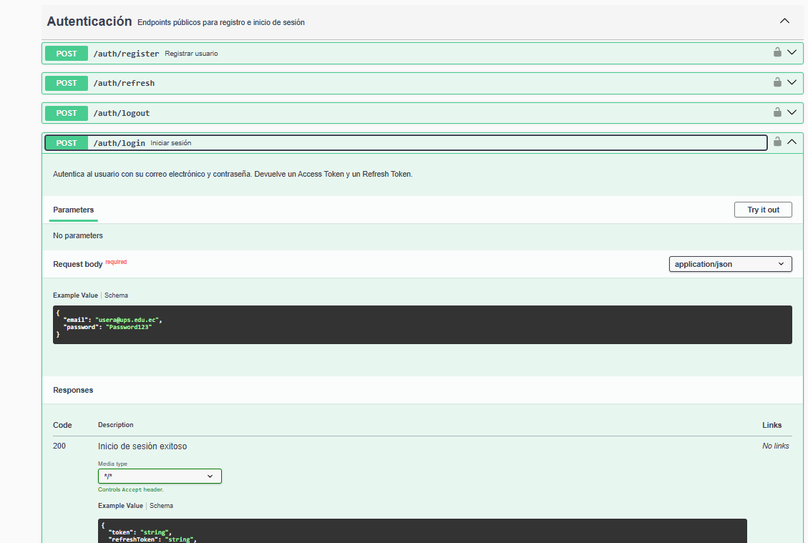

---

## Captura del botón Authorize

- bearerAuth
- JWT

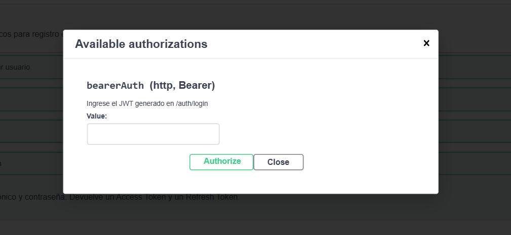

---

## Captura de endpoint ADMIN con usuario normal
Endpoint:

GET /api/products
Usar token con:

ROLE_USER
Debe evidenciar:

403 Forbidden

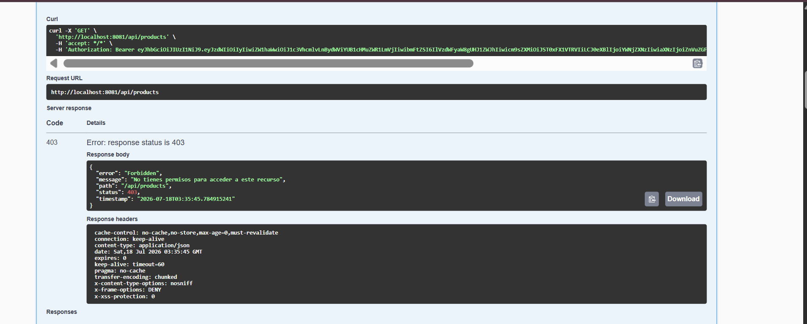

---

## Captura de endpoint ADMIN con usuario administrador
Endpoint:

GET /api/products
Usar token con:

ROLE_ADMIN
Debe evidenciar:

200 OK

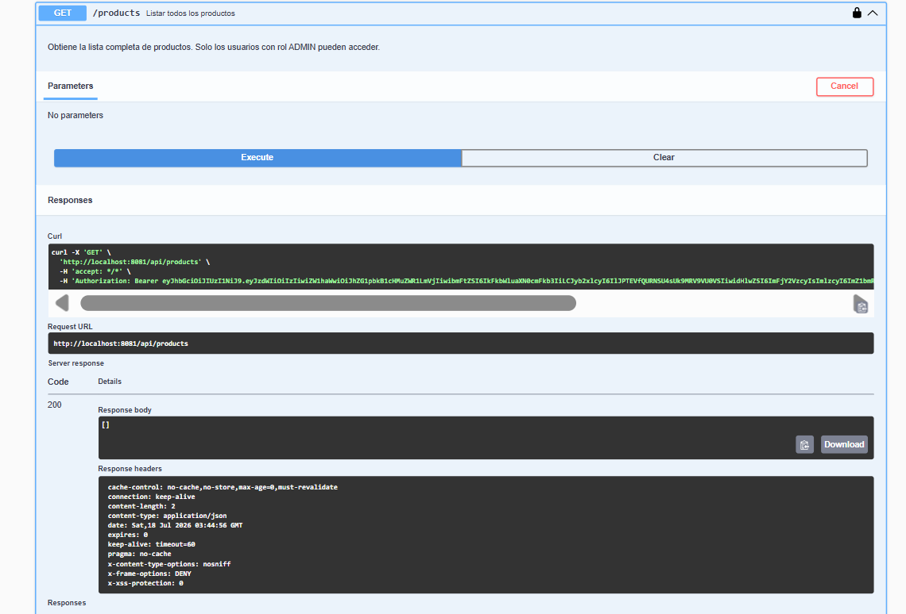

---

## Endpoint protegido con JWT

Se verificó el acceso a endpoints protegidos utilizando el token generado.

Sin token:

```text
401 Unauthorized
```

Con token válido:

```text
200 OK
```

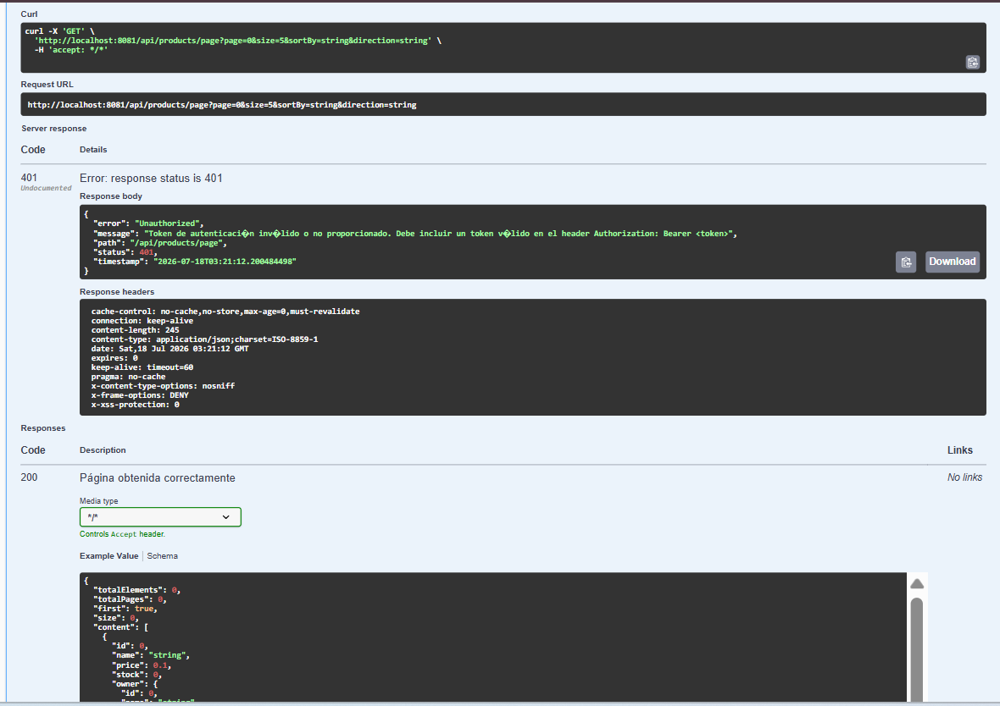

---

# Preguntas finales

## ¿Cuál es la diferencia entre Swagger UI y OpenAPI?

OpenAPI es una especificación estándar utilizada para describir una API REST mediante información como rutas, métodos HTTP, parámetros, respuestas y seguridad.

Swagger UI es una herramienta visual que utiliza esa información OpenAPI para mostrar una interfaz donde los desarrolladores pueden consultar y probar los endpoints.

---

## ¿Por qué Swagger puede ser público pero los endpoints seguir protegidos?

Swagger solamente representa la documentación de la API. Permitir el acceso a la interfaz no significa permitir el acceso a los recursos protegidos.

Los endpoints continúan protegidos mediante Spring Security y JWT, por lo que requieren autenticación cuando corresponde.

---

## ¿Cómo se configura Swagger para enviar un JWT en Authorization Bearer?

Se configura un esquema de seguridad Bearer dentro de OpenAPI utilizando:

```java
SecurityScheme.Type.HTTP
.scheme("bearer")
.bearerFormat("JWT")
```

Luego Swagger permite ingresar el token mediante el botón Authorize y automáticamente agrega:

```http
Authorization: Bearer TOKEN
```

en las solicitudes realizadas contra endpoints protegidos.

---

# Conclusión

La API REST quedó documentada utilizando Swagger y OpenAPI, permitiendo consultar y probar los endpoints desde una interfaz gráfica.

Además, se integró correctamente la autenticación JWT dentro de Swagger, logrando proteger los recursos privados y mantener disponibles los endpoints públicos como registro y login.

La documentación generada facilita el desarrollo, pruebas y mantenimiento del backend.

---------------------------------------------------------------------------------------------------

# Práctica 16: Despliegue portable de Spring Boot con Docker y Nginx en Ubuntu Server

## Objetivo

El objetivo de esta práctica fue realizar el despliegue de una aplicación Spring Boot utilizando Docker en un servidor Ubuntu, configurando variables de entorno, contenedores independientes y Nginx como proxy inverso.

La implementación permite ejecutar la misma imagen Docker en diferentes ambientes sin modificar el código fuente, separando la configuración de la aplicación mediante variables de entorno.

## Arquitectura implementada

La arquitectura final utilizada fue la siguiente:

```
Windows (máquina anfitriona)
          |
          | HTTP
          |
Ubuntu Server (VirtualBox)
          |
          |
       Nginx :80
          |
          |
Spring Boot API :8081
          |
          |
   PostgreSQL :5432
```

Los servicios utilizados fueron:

- Ubuntu Server 24.04
- Docker Engine
- Spring Boot API
- PostgreSQL 16
- Nginx Alpine
- VirtualBox

---

# 1. Contenedores Docker ejecutándose

Después de configurar los servicios se verificó que los contenedores se encuentren activos mediante el comando:

```bash
docker ps
```

Resultado obtenido:

```
CONTAINER ID   IMAGE                    STATUS
nginx          nginx:alpine             Up
fundamentos-api-test fundamentos-api:1.0 Up
postgres-dev   postgres:16              Up
```

Los contenedores utilizados fueron:

- nginx: encargado de recibir las solicitudes HTTP.
- fundamentos-api-test: contenedor donde se ejecuta la aplicación Spring Boot.
- postgres-dev: contenedor encargado de la base de datos PostgreSQL.

Evidencia:

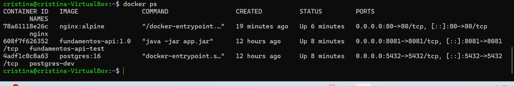

---

# 2. Configuración de red Docker

Se creó una red privada para permitir la comunicación entre los contenedores:

```bash
docker network ls
```

Resultado:

```
app-network
bridge
host
none
```

La aplicación Spring Boot fue conectada a la red:

```
app-network
```

La verificación se realizó con:

```bash
docker inspect fundamentos-api-test
```

Esta configuración permite que los contenedores puedan comunicarse utilizando la red interna de Docker.

---

# 3. Configuración de reinicio automático

Para mantener los servicios disponibles después de reiniciar Ubuntu Server se configuró una política de reinicio automático:

```bash
docker update --restart unless-stopped nginx

docker update --restart unless-stopped fundamentos-api-test

docker update --restart unless-stopped postgres-dev
```

Con esta configuración los contenedores vuelven a iniciar automáticamente cuando Docker se inicia nuevamente.

---

# 4. Configuración de Nginx como proxy inverso

Se utilizó Nginx para recibir las solicitudes HTTP y redirigirlas hacia la API Spring Boot.

Archivo utilizado:

```
nginx/default.conf
```

Configuración principal:

```nginx
upstream spring_backend {
    server fundamentos-api-test:8081;
}

server {

    listen 80;

    location = / {
        default_type text/plain;
        return 200 "Nginx activo\n";
    }

    location /api/ {

        proxy_pass http://spring_backend;

        proxy_set_header Host $host;
        proxy_set_header X-Real-IP $remote_addr;

    }
}
```

La configuración fue validada mediante:

```bash
docker exec nginx nginx -t
```

Resultado:

```
syntax is ok
test is successful
```

Evidencia:

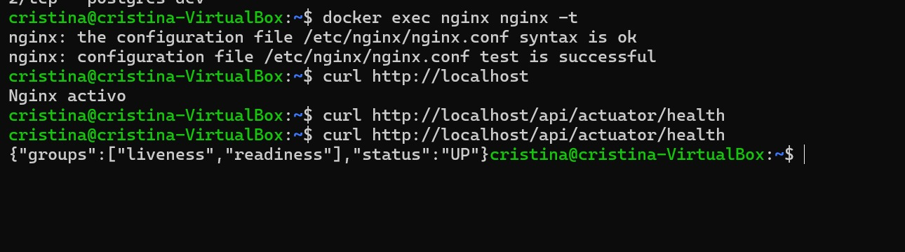

---

# 5. Prueba de funcionamiento de Nginx

Desde Ubuntu Server se realizó la prueba:

```bash
curl http://localhost
```

Respuesta obtenida:

```
Nginx activo
```

Esto confirmó que el servidor Nginx se encuentra funcionando correctamente.

---

# 6. Validación del estado de la API Spring Boot

Se realizó la prueba del endpoint Actuator mediante:

```bash
curl http://localhost/api/actuator/health
```

Respuesta obtenida:

```json
{
  "groups": [
    "liveness",
    "readiness"
  ],
  "status": "UP"
}
```

El resultado confirma que la aplicación Spring Boot se encuentra ejecutándose correctamente detrás del servidor Nginx.

Evidencia:

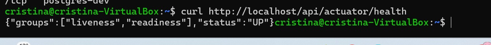

---

# 7. Prueba desde la máquina anfitriona Windows

Para comprobar la comunicación externa se accedió desde Windows mediante el navegador:

```
http://localhost/api/actuator/health
```

La respuesta obtenida fue:

```json
{
  "groups": [
    "liveness",
    "readiness"
  ],
  "status": "UP"
}
```

Esta prueba permitió verificar la comunicación completa entre Windows, Ubuntu Server, Nginx y Spring Boot.

Evidencia:

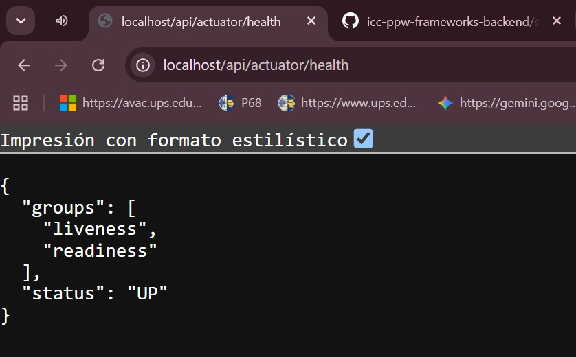

---

# 8. Prueba de autenticación mediante Bruno

Se realizó una prueba de autenticación utilizando Bruno mediante el endpoint:

```
POST /api/auth/login
```

Al enviar las credenciales correctas se obtuvo una respuesta con el token JWT:

```json
{
  "token": "JWT_ACCESS_TOKEN",
  "refreshToken": "JWT_REFRESH_TOKEN",
  "userId": 1,
  "name": "Cristina",
  "email": "cristina.docker@ups.edu.ec",
  "roles": [
    "ROLE_USER"
  ],
  "type": "Bearer"
}
```

La prueba confirmó el correcto funcionamiento de:

- Autenticación de usuarios.
- Generación de Access Token.
- Generación de Refresh Token.
- Manejo de roles mediante Spring Security.

Evidencia:

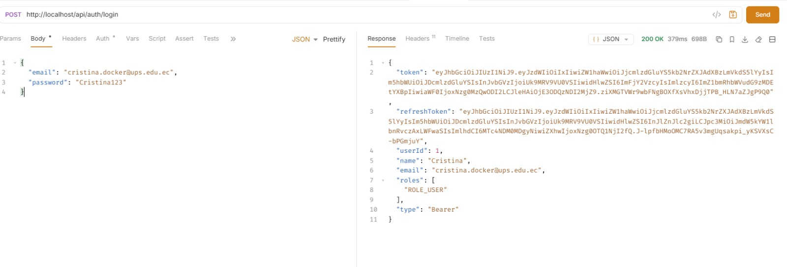

---

# 9. Resultado final del despliegue

La implementación final quedó funcionando con el siguiente flujo:

```
Cliente Windows

        |
        |
        v

Nginx Docker
Puerto 80

        |
        |
        v

Spring Boot API
Puerto 8081

        |
        |
        v

PostgreSQL
Puerto 5432
```

La aplicación quedó desplegada de manera portable utilizando Docker, permitiendo separar la configuración del código y facilitando futuros despliegues en otros ambientes.

---

# Conclusiones

Durante esta práctica se logró desplegar una API Spring Boot dentro de un entorno Docker en Ubuntu Server.

Se configuró Nginx como proxy inverso para administrar las solicitudes HTTP y comunicar la máquina anfitriona con la aplicación desplegada.

Además, se verificó el correcto funcionamiento de la aplicación mediante pruebas con Actuator, navegador web y Bruno, comprobando que la autenticación JWT, la conexión con PostgreSQL y los servicios Docker funcionan correctamente.

La separación de configuración mediante variables de entorno permite reutilizar la misma imagen Docker en diferentes ambientes sin necesidad de modificar el código fuente.

---


## Autor

**Cristina Loja**

Ingeniería en Ciencias de la Computación

Universidad Politécnica Salesiana


